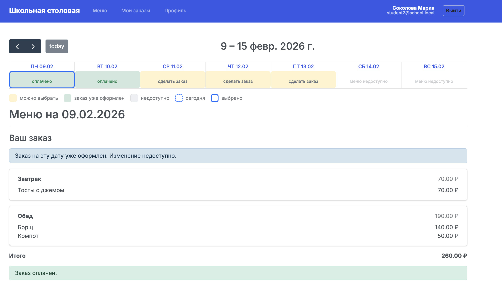

# canteen_management_system: управление столовой

Командный кейс № 2  
**Московская предпрофессиональная олимпиада школьников**  
Профиль: *Информационные технологии*

## Описание проекта

**«Управление столовой»** — это веб-приложение, предназначенное для автоматизации учёта и контроля питания в школьной столовой.

Современные школы нуждаются в удобных и прозрачных инструментах для организации питания учащихся. Использование бумажных журналов, талонов и устаревших систем учёта затрудняет контроль процессов, снижает точность данных и не позволяет эффективно анализировать информацию.

Данный проект реализует автоматизированную информационную систему школьного питания, которая обеспечивает удобство для пользователей, прозрачность процессов и безопасность питания.

## Назначение системы

Веб-приложение предназначено для:
- планирования и учёта школьного питания;
- оформления и оплаты заказов на питание;
- контроля фактической выдачи блюд;
- учёта пищевых аллергий и предпочтений учащихся;
- анализа статистики и формирования отчётности.

Реализация системы позволяет повысить эффективность работы школьной столовой и улучшить качество обслуживания учащихся.

## Роли пользователей

В системе предусмотрены следующие роли с различными уровнями доступа:
- **Ученик**
- **Сотрудник столовой (повар)**
- **Администратор**

## Функциональные возможности

### Возможности для ученика
- регистрация и авторизация в системе;
- просмотр меню завтраков и обедов;
- оформление и оплата питания (разовый платёж или абонемент);
- отметка о получении питания;
- указание пищевых аллергий и предпочтений;
- получение предупреждений о противопоказанных аллергенах;
- оставление отзывов о блюдах.

### Возможности для сотрудника столовой
- авторизация в системе;
- учёт выданных завтраков и обедов;
- контроль остатков продуктов и готовых блюд;
- оформление заявок на закупку продуктов.

### Возможности для администратора
- авторизация в системе;
- просмотр статистики оплат и посещаемости;
- согласование заявок на закупку продуктов;
- формирование отчётов по питанию и затратам.

## Технологии

Веб-приложение реализовано с использованием следующего стека технологий:

- **Python** — язык программирования серверной части;
- **Flask** — веб-фреймворк для реализации серверной логики и маршрутизации;
- **PostgreSQL** — реляционная база данных для хранения данных системы;
- **SQLAlchemy** — ORM для работы с базой данных;
- **HTML, CSS** — разметка и оформление пользовательского интерфейса;
- **HTMX** — динамическое обновление интерфейса без использования тяжёлых SPA-фреймворков.


# Демонстрационное видео

[](https://disk.yandex.ru/i/tuChOCpqqRuevA)

*Нажмите на изображение, чтобы посмотреть демонстрационное видео работы системы или перейдите по ссылке:* https://disk.yandex.ru/i/tuChOCpqqRuevA 


# Установка и запуск

Ниже приведена инструкция по установке и запуску проекта в локальной среде.
Процесс автоматизирован с помощью скриптов и требует минимального количества шагов.

---

## Требования

Перед началом установки убедитесь, что на компьютере установлены:

- **Python 3.11 или выше**
- **PostgreSQL 14 или выше**

Утилиты PostgreSQL (`psql`, `createdb`) должны быть доступны из командной строки
(добавлены в `PATH`).

---

## Установка на macOS

### 1) Клонирование репозитория
```bash
git clone https://github.com/abikoz/PredProf.git
cd PredProf
```

### 2) Создание виртуального окружения и установка зависимостей
```bash
python3 -m venv venv
source venv/bin/activate
pip install -r requirements.txt
```

### 3) Инициализация базы данных
В проекте используется автоматический скрипт инициализации базы данных.

```bash
chmod +x scripts/init_db.sh
./scripts/init_db.sh
```

Скрипт автоматически:
- создаёт базу данных;
- применяет структуру (`db/schema.sql`);
- загружает демонстрационные данные (`db/seed.sql`).

### 4) Настройка переменных окружения
Создайте файл `.env` на основе `.env.example` и при необходимости измените параметры
подключения к базе данных.

### 5) Запуск приложения
```bash
python app.py
```

После запуска приложение будет доступно по адресу, указанному в консоли
(обычно `http://127.0.0.1:5000/`).

---

## Установка на Windows

### 1) Клонирование репозитория
```powershell
git clone https://github.com/abikoz/PredProf.git
cd PredProf
```

### 2) Создание виртуального окружения и установка зависимостей
```powershell
python -m venv venv
venv\Scripts\activate
pip install -r requirements.txt
```

### 3) Инициализация базы данных
Для Windows используется PowerShell-скрипт:

```powershell
powershell -ExecutionPolicy Bypass -File scripts\init_db.ps1
```

Скрипт автоматически:
- создаёт базу данных;
- применяет структуру (`db/schema.sql`);
- загружает демонстрационные данные (`db/seed.sql`).

> Если скрипт сообщает, что `createdb` или `psql` не найдены, убедитесь, что путь к
> PostgreSQL добавлен в `PATH` (обычно `C:\Program Files\PostgreSQL\16\bin`).

### 4) Настройка переменных окружения
Создайте файл `.env` на основе `.env.example` и при необходимости измените параметры
подключения к базе данных.

### 5) Запуск приложения
```powershell
python app.py
```

После запуска приложение будет доступно по адресу, указанному в консоли
(обычно `http://127.0.0.1:5000/`).

---

## Примечание

В проекте используются демонстрационные данные, предназначенные для проверки
функциональности системы в рамках олимпиады.


## Статус проекта

Проект разработан в рамках командного кейса  
**Московской предпрофессиональной олимпиады школьников**.
